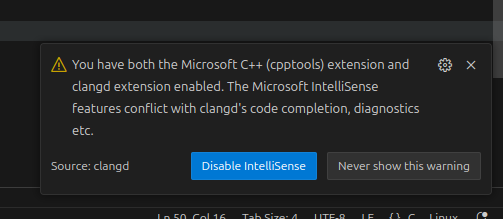
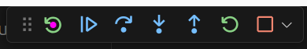

# Embedded Development in VS Code: OpenOCD + GDB on the TM4C

Embedded development historically has relied heavily on proprietary software development tools such like Keil which often feel bloated and are not always supported on all major operating systems. Open On-Chip Debugger (OpenOCD) and other modern tools allow for more flexible configuration, feel snappier, let us use modern editors with language servers for code completion and syntax highlighting, and are maintained by active communities.

This guide will walkthrough the steps necessary to set up VS Code for embedded development on the EK-TM4C123GXL Launchpad development board. I want to stress that it is by no means mandatory that you complete this, and I would suggest only proceeding if you have spare time, are proficient with the terminal, and would like to learn some new tools. These steps were completed on a fresh install of Ubuntu 24.04, but with minimal tweaks should be doable on macOS and Windows.

The end goal of this guide is to be able to use VS Code to build, flash, and debug our projects for the TM4C and take advantage of the snappiness compared to Keil, code completion, and syntax highlighting. As a result, we will still be using a lot of proprietary ARM software within VS Code for building our projects, and we will not be building from scratch with a custom linker script (though that would be another educational project!).

## Miscellaneous Packages

We will need the following packages for our setup. Install all of these:

| Package | Purpose | Install Command |
| ---- | ----- | -------------------- |
| OpenOCD |  Debug and flash interface for microcontrollers | `sudo apt-get install openocd` |
| gdb-multiarch |  Version of GDB that enables debugging remote targets with different architectures   | `sudo apt-get install gdb-multiarch` |
| binutils-multiarch | Dependencies for `gdb-multiarch` | `sudo apt-get install binutils-multiarch`| 
| clangd | Language server for clang compiler, you do not need to install `clang` itself | `sudo apt-get install clangd` |

To make sure our version of GDB uses the multiarch variants of its dependencies, we are going to create symlinks. This is an ugly workaround to [what appears to be a known problem with Cortex-Debug](https://github.com/Marus/cortex-debug/issues/744), but is easy enough and *shouldn't* cause any issues. Create the links with:
    <pre>sudo ln -s /usr/bin/nm /usr/bin/nm-multiarch
    sudo ln -s /usr/bin/objdump /usr/bin/objdump-multiarch</pre>
(`nm` and `objdump` are used to dump symbols and code from binaries, we need the `-multiarch` versions to dump TM4C binaries on our computers).

## The ARM VS Code Suite

Luckily, ARM provides a VS Code extension pack that enables development for their embedded boards! There is a catch, though. These extensions do not support the *ancient* ICDI interface the Launchpad uses to debug and flash. These extensions also use ARM's newer `csolution` projects as opposed to Keil's uVision projects, but they provide a tool that will seamlessly convert between the two. We will later set up OpenOCD and GDB to flash and debug our devices respectively.

1. Install the ARM Keil Studio Pack Extension by ARM in VS Code's extensions marketplace.
2. If on Linux, create a udev rule that allows access to the USB debug device with the following command:
   
    `echo 'ATTRS{idVendor}=="1cbe", ATTRS{idProduct}=="00fd", GROUP="users", MODE="0660"' | sudo tee /etc/udev/rules.d/99-stellaris-launchpad.rules`

3. In VS Code, go to File > Preferences > Settings, search for "Device-manager:Manage All Devices" and enable it. This will show USB devices in menus the extension may not see as debug chips otherwise.
   
4. Connect your Launchpad to your computer.

5. Go to the device manager on the left of VS Code installed as part of the extension. Add Device > In Circuit Debug Interface. Click OK when asked if you would like to configure this device. Name the device TM4C or something identifiable. In the "Enter a CMSIS pack for the device" prompt, search "TM4C" and select "Keil::DFP_TM4C@1.1.0," then when asked for the specific device choose "TM4C123GH6PM."

6. When prompted, activate the ARM Keil Community license (the license is free for non-commerical use).

## Cortex-Debug

Cortex-Debug is another powerful extension that will allow us to create a custom launch configuration to flash our board and run the debugger in one click. Cortex-Debug bridges the gap between OpenOCD (our interface to the TM4C), GDB (our debug environment), and VS Code's debug GUI.

1. Install Cortex-Debug by marus25 in VS Code's extension marketplace.

2. Create the `.vscode/` directory in the same directory as `.git` and `cd` into it.

3. Here, create `launch.json` with the following contents:
    <pre>{
        "version": "0.2.0",
        "configurations": [
            {
                "cwd": "${workspaceRoot}",
                "executable": "${command:arm-debugger.getApplicationFile}",
                "name": "Debug with OpenOCD",
                "request": "launch",
                "type": "cortex-debug",
                "servertype": "openocd",
                "configFiles": ["/usr/share/openocd/scripts/board/ti_ek-tm4c123gxl.cfg"],
                "openOCDLaunchCommands": [
                    "program ${command:arm-debugger.getApplicationFile} verify"
                ],
                "searchDir": [],
                "runToEntryPoint": "main",
                "gdbPath": "/usr/bin/gdb-multiarch",
                "overrideLaunchCommands": [
                    "-enable-pretty-printing"
                ],
            }
        ]
    }</pre>
    This stores our configuration settings for the Cortex-Debug extension. With the current steps provided above, you will have to repeat steps 2 and 3 for every new project. [Here is how to make this launch configuration global if you prefer.](https://stackoverflow.com/questions/36868021/is-it-possible-to-have-a-global-launch-json-file) If you see an "Arm Debugger" configuration, you can either delete it or leave it be, but we will not be using it. This debugger only works on newer boards that use ULINK2, ULINKplus, or CMSIS-DAP interfaces (we need the ICDI interface).
    
## OpenOCD

The launch configuration we created in the previous step will run OpenOCD to flash and debug our code on its own. In the future, I may add more information to this section about using OpenOCD from the command line yourself to flash, debug, and reset embedded boards. OpenOCD is very powerful, supports an extraordinary amount of boards, and is super easy to create a board configuration for if you ever needed to (believe it or not, the Launchpad already had a configuration).

## Code Completion and Syntax Highlighting with Clangd

`armclang` was installed as part of the ARM VS Code extensions and is the compiler used by the TM4C. For proper syntax highlighting and code completion, we need to use the VS Code extension specific to `clang`, not `gcc` or `msvc`. Doing so is easy especially if you've already installed `clangd` from the table above. Just install the clangd VS Code extension.

In your projects, you may get a notification that IntelliSense and clangd confict:

Disable IntelliSense.

## Using CMSIS to Build

Using CMSIS is super easy.

1. Click the CMSIS button on the left bar in VS Code.
2. "Convert a uVision Project"
3. Choose your `.uvprojx` file.
4. CMSIS will now generate the files necessary to turn the project into a `csolution` project, and will open it. The CMSIS explorer will cleanly layout the source files in your project and works very similarly to Keil.
5. In the top bar labeled "CMSIS: \<project name\>", I would suggest choosing to hide the Run button. We will only be using build and debug. Debug will flash our board automatically. **Debug does not automatically build the project.**
6. To build, click the hammer. You may have to work out some dependencies/include issues if you just converted from a uVision project, but I have had minimal issues with the conversion feature.
   
## Setting up CMSIS to Debug with Cortex-Debug

1. Click the CMSIS button on the left bar in VS Code.
2. In the top bar labeled "CMSIS: \<project name\>", click the gear.
3. In "Run and Debug," choose "Debug with OpenOCD" for the Debug Configuration. The Run Configuration does not matter.
4. Now when you click the debug button the VS Code debugger should launch. The debugger allows you to step through, set breakpoints, and watch variables in the VS Code GUI. Another nice tip: along with the regular play/pause, step into/over/out of debugging controls, you can reset the board with the left most button on the top ribbon. 

